# CS_199_Final_Project

Overview/Goal:

For my final project, I used ktor to try to build a web application similar to
Goodreads.  Since I love to read, I thought it would be cool to recreate something
that related to reading and books.  When starting this project, my goal was to
include a way for users to log books they've read, books they want to read, books
they loved, and books they would recommend.  In addition, I wanted to include
pages where users could review, browse, and view recommended books sent to them by
other users.  However, I had faced several obstacles while working on this project and
was thus unable to get my web application working like I envisioned.  Below, I will
explain the details of my code for my web application, tasks I was able to accomplish,
and the challenges I faced.

==============================================================

The Details of My Web Application:

At the beginning of my Main.kt file, I created a few data classes, but as of right now,
I have only utilized two of the data classes I created: 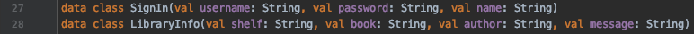
I am using the ```SignIn``` data class to hold user information.  I currently don't have
any use for the username and password values, but I think for the future, it would be
used to validate the user signing in.  I will explain the use of the ```LibraryInfo```
data class later on.

In my ```Application.userPage()``` function, I installed Mustache, which is a template
that I used to send information from the backend of my web application to the frontend of
my application.  An example of it will be shown later on.  Also in my
```Application.userPage()``` function, I create three different routes.  Here is the
first route: 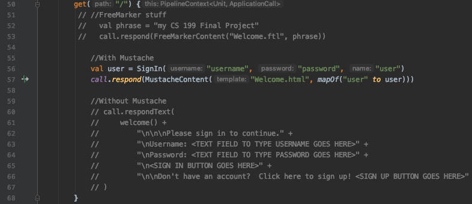  As can be seen, I tried several ways to display
the front end of my web application, but in the end, I ended up using Mustache.  This is
how this web page ends up looking like: 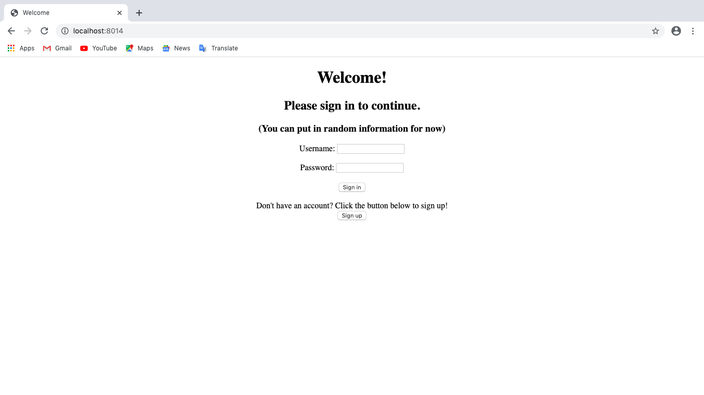  My second route is for
after users have signed into their account and immediately after clicking the sign in
button (I currently don't have that working yet), it should take the user to their home
page.  Here is the code for the second route: 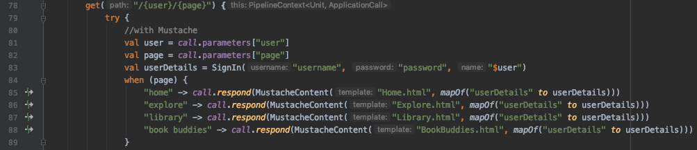  As can be seen
on line 83, I created an instance of the ```SignIn``` data class called ```userDetails```
to hold the user's information.  In line 85, I call something called ```MustacheContent```
--this allows me to pass information stored in ```userDetails``` to the HTML file
```Home.html```.  The ```Home.html``` file: 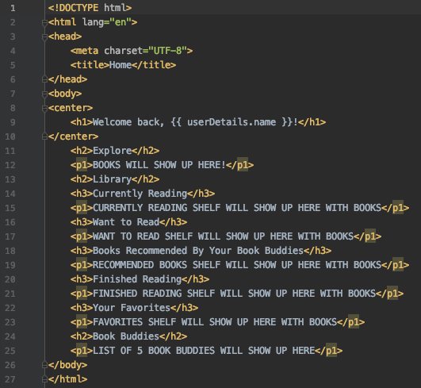  The information
that I passed using ```MustacheContent``` can be seen being received on line 9 in the
picture above by using double brackets ```{{ }}```.  So, on line 9, I'm calling
```userDetails.name```, which was passed from ```MustacheContent```.  In the end, I get
a user home page that looks like this: 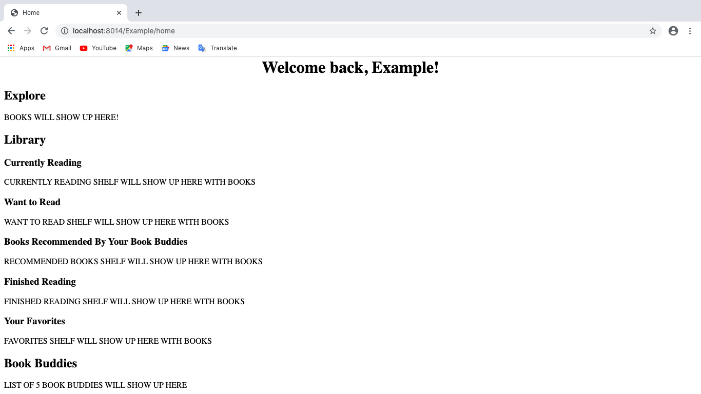  Like I wanted, the name
of the user shows up at the top of the page.  If you look in the url, the user's name
(technically username) shows up as the first "path."  For the other pages included
in this route, I followed the same steps I took for the home page, and their pages
look like this on the web application--Explore page: 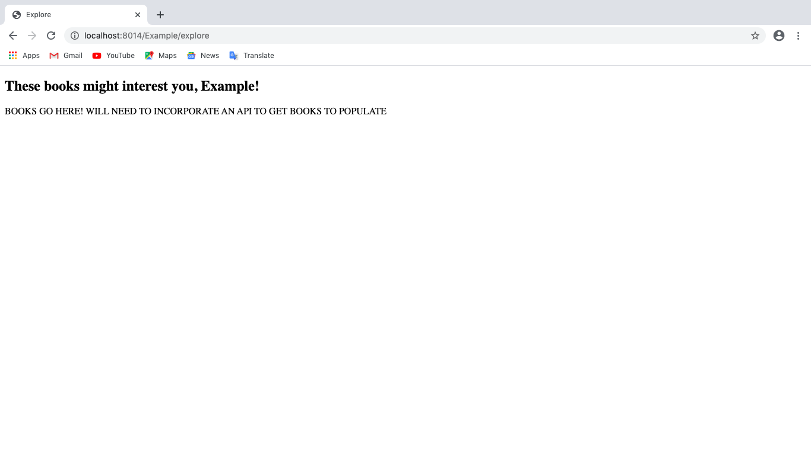 Library
page: 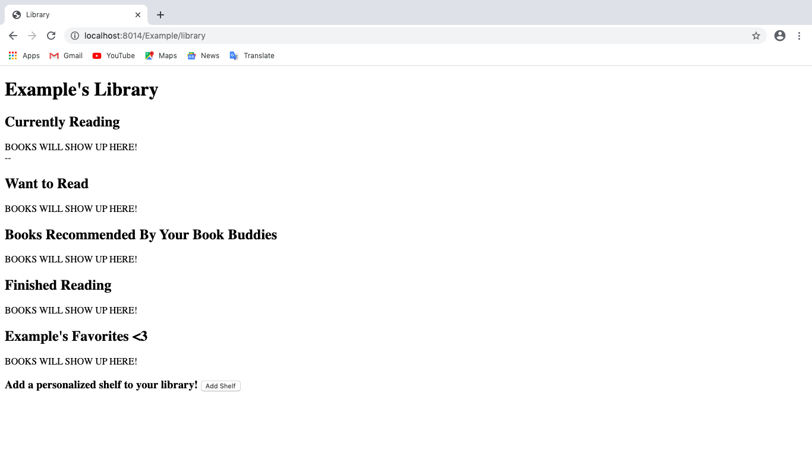  Book Buddies page: 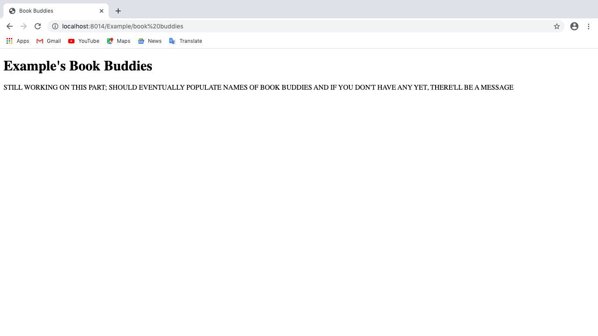  As you
can see, when you go to these web pages right now, the pages look unfinished with a lot
of messages in all caps--these are notes to both the user and myself on what
the page should contain and what I still need to do.  So, the web application is still
a work-in-progress :)  My third route is for the library page.  What I initially wanted
for the library page was to have some books populate under the specific shelves
displayed, but I was unable to get it to work properly, so for now, I created a separate
path for each shelf.  Here is how the code for my third route looks like:
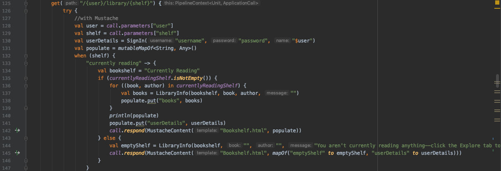  The code on lines 134-146 are similar for each shelf page,
so I'm only going to show a picture of the code for one of the pages, but the code on
those lines are for populating the shelves with an example group of books I created,
which I created using a map: 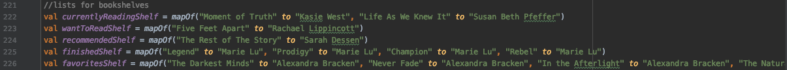  Here is how the page for one
of the shelves look like: 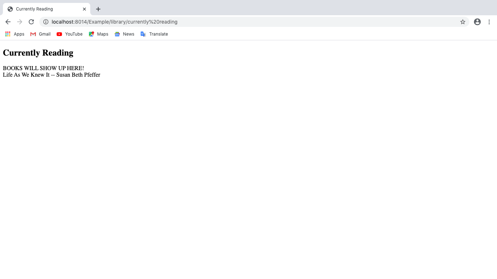  As can be seen, I am
unable to get all the books in the map to populate, so I still need to work on that,
but after working on this portion of my web application for a good amount of time, I
am happy to be able to get at least one book for each shelf to populate.


==============================================================

The Challenges I Faced:

-FreeMarker: While working on my web application for the second checkpoint, I realized
that I needed a way to connect the front-end and back-end parts of my application.
I had already created two routes for my web application: one that led to the welcome
page, which prompted users to sign in, and another that led to the user's personal
page, which had several pages within it dedicated to some of the features I had
described above in my overview.  I had outlined in the ```call.respondText```
for these routes how I wanted the front end to work and look like, and after quickly
learning the basics of HTML, I began converting what I had in the ```call.respondText```
over to HTML files, which I found would allow me to construct the front-end much
better.  I discovered on the ktor website the template FreeMarker and attempted to use
it as a way to connect the front-end and back-end parts of my application since it
allows string interpolation in HTML files.  However, after following the instructions
on the ktor website to install FreeMarker, I was having trouble using its feature of
string interpolation.  I am not sure if it was because the template did not install
properly in my application or if it was because of some other reason, but I was unable
to access the .ftl file, which I believe allows you to use FreeMarker in your
application.  I tried looking online for a way to fix my problem, but I could not
find anything, so I decided to try another template called Mustache, which worked
out much better.

-Populating shelves: I had a lot of trouble trying to populate the shelves of my library
page with books.  Initially, I had tried populating the books straight onto the library
page itself, but after many unsuccessful attempts, I decided to created a separate path
for each shelf to see if that would work any better.  Fortunately, I was able to populate
one (different) book from the map I created for each shelf, which was a step up from
a) having no books populate in any shelf, b) having the same book populate for all the
shelves, c) having one book populate into the shelves but breaking all other web pages
(as you can see, a lot of problems :/).  However, I still have yet to figure out how to
populate all the books in the map I created for my shelves before I start implementing
an API (which I hope to do in the future).

-Buttons: I had trouble trying to figure out how to connect the buttons from my HTML
page to my backend Kotlin code.  I couldn't really work that much on the buttons and
the functions the buttons would call when clicked because it required information that
the user would input in the frontend pages, and since I had a lot of trouble trying
to figure out how to connect my frontend and backend parts, I was unable to get very
far in this part of my web application.

==============================================================

Closing/For the Future:

For the future, I hope to implement everything I had originally hoped to have working
in my web application.  I also hope to implement an API, which I can use for the
Explore page of my web application.  Since I currently have my shelves on a different
page than my library, I hope to also migrate that back to the Library page, so the
books on those shelves show up on the Library page instead of having to open another
page to display the books on those shelves.  Finally, if you would like to see more of
my code (and portions of code that I commented out and didn't include in this README),
feel free to look through my repository.  Thank you!
